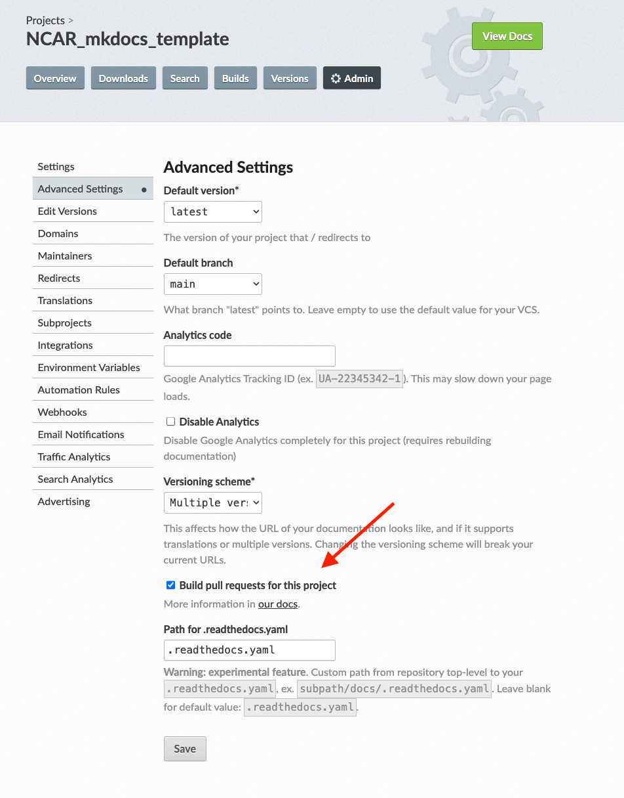

# How to Use this Template Repository? 🛠️

**Estimated time to completion: 20 minutes 🕗**

In this page, you will find information on how to start your own docs project using this template. This guide will walk you through the steps of getting started with such a template, including initial setup, customization, and deployment.

## Step 1: Create a New Repository Using This Template

1. Open this repository Github page: [https://github.com/NCAR/NCAR_mkdocs_template](https://github.com/NCAR/NCAR_mkdocs_template) and click the **"Use this template"** button on the top right of [this repository](https://github.com/NCAR/NCAR_mkdocs_template) to create a new repository using this template. Please see the image below for reference:


	


2. Once you click on "Use this Template" and "Create a new repository", Github opens a new page. Here give your repository a name. Then click "Create Repository" button. This will create a new repository under your account with the same files and structure as this repository.

In general, the reposiotry is organized into the following sections:

```
mkdocs.yml        # The MkDocs configuration file.
themes/           # Customized theme files.
    ...           # (sourced from https://github.com/NCAR/NCAR_mkdocs_material_themes)
docs/
    index.md      # The documentation homepage.
    ...           # Other markdown pages, images and other docs files.
conda.yaml        # A conda environment definition with the Python dependencies to build the project.
.readthedocs.yml  # The configuration file for readthedocs hosting.
```

## Step 2: Modify your Repository to include your content:

Once the repository is created, you can clone it to your local machine and start working on it. You can add new markdown files, images, and other documentation files to the `docs` directory. You can also customize the `mkdocs.yml` file to change the site name, navigation, and other settings.


For example, edit the `mkdocs.yml` file to customize the site name, navigation, and other settings. For example, you can change site name, site description, and author:

```
# ------------------------------------
# -------- Project Information -------
# ------------------------------------
site_name: NCAR MkDocs Template
site_description: A template for creating NCAR mkdocs
repo_url: https://github.com/NCAR/NCAR_mkdocs_template/
site_url: https://NCAR.github.io/NCAR_mkdocs_template/
site_author: CISL CSG (Consulting Services Group)
```

You can also customize the pages you want to show by editing the `nav` section of the `mkdocs.yml` file. For example, you can add new pages to the navigation. The following example shows how to add new pages to the navigation:

```
# ------------------------------------
# -------- Navigation ----------------
# ------------------------------------
nav:
  - Home: index.md
  - Example Page 1:
	- Example Subpage 1: example-page-1/example-subpage-1.md
	- Example Subpage 2: example-page-1/example-subpage-2.md


  - Contributing: contributing.md
  - About:
	- License: about/license.md
	- Release Notes: about/release-notes.md
```

Please see the [MkDocs documentation](https://www.mkdocs.org/user-guide/configuration/) for more information on customizing the `mkdocs.yml` navigation and other settings.

## Step 3: Building the Documentation Locally

If you want to build the documentation locally to see the changes you've made, you can do so by following these steps:

### Create a `conda` Environment
To build the documentation locally and preview it, you'll need to install certain dependencies. Although this step is optional, we strongly recommend it.

The example provided here creates a new  `conda` environment named `mkdocs` from the provided `conda.yaml` file.

  ```bash
  conda env create -f conda.yaml
  conda activate mkdocs
  ```

#### Preview Documentation Locally
You can preview your documentation locally to make sure that your changes do not introduce any errors. With MkDocs, you can preview your changes by running `mkdocs serve` in your terminal. This starts a local server where you can preview your work.

  ```
  mkdocs serve --strict
  ```

!!! note
      `--strict` flag will enable strict mode and treat warnings as errors. This is useful to ensure that your changes do not introduce any issues such as new pages that does not exist.  Occasionally you may want to omit the `--strict` flag, for example when adding new pages that have not yet been committed through `git`.


Please note that while building and previewing the documentation locally, is optional, it is a good practice to do so to ensure that your changes do not introduce any errors.

## Step 4: Deploying the Documentation

Once you have made your changes and are ready to deploy the documentation, you can do so by following these steps: 


1. Go to [ReadTheDocs.org](https://readthedocs.org/) and sign in with your Github account.

2. Click on "Import a Project" and select this new repository from the list of your repositories. Please note that for deploying the docs to ReadTheDocs, you need to have a `readthedocs.yml` file in the root of your repository. This file is already included in this template repository.

3. Once the repository is imported, ReadTheDocs will automatically build the documentation and host it at a unique URL. You can access the documentation at this URL and share it with others. 

	!!! note
		Please note that you need to have your repository set to public in order to deploy the documentation to ReadTheDocs as ReadTheDocs does not support private repositories with free accounts.

4. For ReadTheDocs to build the documentation successfuly, you need to add an environment variable to your ReadTheDocs project settings. Here we used [ReadTheDocs  user-defined environment variables ](https://docs.readthedocs.io/en/stable/environment-variables.html) to distinguish the `DEPLOY_TARGET` at build time (primary site, `iframe`, etc...) in case you want to deploy multiple versions of the documentation for embedding in arc or other sites. 

For this go to the Admin page on ReadTheDocs and click on "Environment Variables" and add a new environment variable with the name `DEPLOY_TARGET` and the value `NCAR_primary` or `arc_iframe` depending on the target you want to deploy.

   ```pre
	# deploy the primary site: https://readthedocs.org/projects/ncar-hpc-docs/
	DEPLOY_TARGET=NCAR_primary
	
	# build the ARC iframed style site: https://readthedocs.org/projects/ncar-hpc-docs-arc-iframe/
	DEPLOY_TARGET=arc_iframe
   ```
Once you have added the environment variable, ReadTheDocs will automatically build the documentation and host it at a unique URL. You can access the documentation at this URL and share it with others.

5. **Optional:** If you are interested in ReadTheDocs to preview your documentation from a pull request, you can do so by going on the ReadTheDocs.org and your project. Then go to the "Admin" page and click on "Advanced Settings" and mark the "Pull Request Preview" feature. Please see the screenshot below. This will allow ReadTheDocs to build a preview of your documentation and add it to the pull request. This allows you to preview your changes before they are merged into the main branch.




!!! note
	If you are interested in creating another page for embedding the docs in ARC, you can do so by creating a new ReadTheDocs project and adding the `DEPLOY_TARGET` environment variable with the value `arc_iframe`. This will create a new version of the documentation with a customized theme to be easily embedded in ARC.

If you have any questions regarding this workflow, please feel free to reach out to [CISL Consulting Services Group](mailto:csg@ucar.edu) for assistance.

## Additional Resources
* [Markdown Cheatsheet](https://www.markdownguide.org/cheat-sheet/)
* [mkdocs documentation](https://www.mkdocs.org/user-guide/configuration/)
* [Material for MkDocs documentation](https://squidfunk.github.io/mkdocs-material/)
* [ReadTheDocs documentation](https://docs.readthedocs.io/en/stable/)
* [NCAR HPC Documentation](https://ncar-hpc-docs.readthedocs.io/en/latest/)
