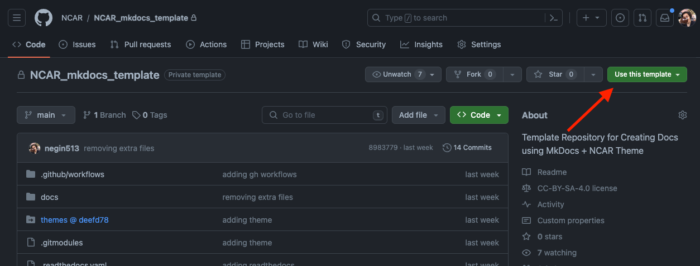

# How to Use this Template Repository? 🛠️

**Estimated time to completion: 20 minutes**

In this page, you will find information on how to start your own docs project using this template. This guide will walk you through the steps of getting started with such a template, including initial setup, customization, and deployment.

## Step1: Create a New Repository Using This Template

1. Open this repository Github page: [https://github.com/NCAR/NCAR_mkdocs_template](https://github.com/NCAR/NCAR_mkdocs_template) and click the **"Use this template"** button on the top right of [this repository](https://github.com/NCAR/NCAR_mkdocs_template) to create a new repository using this template. Please see the image below for reference:





2. Mark "include all branches" and give your repository a name. Then click "Create Repository". This will create a new repository under your account with the same files and structure as this repository.


```

## Step 2: Modify your Repository to include your content:

Once the repository is created, you can clone it to your local machine and start working on it. You can add new markdown files, images, and other documentation files to the `docs` directory. You can also customize the `mkdocs.yml` file to change the site name, navigation, and other settings.

In general, the reposiotry is organized into the following sections:

```
mkdocs.yml        # The MkDocs configuration file.
themes/           # Customized theme files.
    ...           # (sourced from https://github.com/NCAR/NCAR_mkdocs_material_themes)
docs/
    index.md      # The documentation homepage.
    ...           # Other markdown pages, images and other docs files.
conda.yaml        # A conda environment definition with the Python dependencies to build the project.
.readthedocs.yml  # The configuration file for readthedocs hosting.
```

First, edit the `mkdocs.yml` file to customize the site name, navigation, and other settings. For example, you can change site name, site description, and author:

```# ------------------------------------
# -------- Project Information -------
# ------------------------------------
site_name: NCAR MkDocs Template
site_description: A template for creating NCAR mkdocs
repo_url: https://github.com/NCAR/NCAR_mkdocs_template/
site_url: https://NCAR.github.io/NCAR_mkdocs_template/
site_author: CISL CSG (Consulting Services Group)
```


Once you are authorized to use NCAR compute and storage resources, and you have [an account](./accounts/index.md) and the [necessary software](../environment-and-software/index.md), you can follow the procedures described below to log in.


These pages provide information on compiling your code, submitting jobs, and performing other common tasks on all NCAR resources unless otherwise noted:


* Compiling Code on [Derecho](../compute-systems/derecho/compiling-code-on-derecho/index.md) or [Casper](../compute-systems/casper/compiling-code-on-casper/index.md)
* Understanding and Customizing your [User and Software Environment](../environment-and-software/index.md )
* [Starting and Managing Jobs with PBS](../pbs/index.md)
* [Managing Your Resource Allocation](../allocations/index.md)

---

!!!danger "Don’t run `sudo` on NCAR systems!"
    If you need help with tasks that you think require `sudo` privileges, or if you aren’t sure, please contact HPC User Support before trying to run `sudo` yourself. The command fails when unauthorized users run it and sends a security alert to system administrators.


## Logging In

To log in, start your terminal or Secure Shell client and run an `ssh` command as shown here:


=== "Derecho"
    ``` shell
	ssh -X username@derecho.hpc.ucar.edu
	```
=== "Casper"
	``` shell
	ssh -X username@casper.hpc.ucar.edu
	```
=== "Cheyenne"
	``` shell
	ssh -X username@cheyenne.ucar.edu
	```

After running the `ssh` command, you will be asked to authenticate to finish logging in.


The `-X` is optional and requests simple `X11` graphics forwarding to your client.  You can omit `username` in the command above if your Casper username is the same as your  username on your local computer.


!!! tip
    Some users (particularly on Macs) need to use -Y instead of -X when calling ssh to enable X11 forwarding.

---

## New User Resources
* [New User Orientation](../tutorials/new-user-training.md)
* [New User Training for HPC Systems](https://www.youtube.com/watch?v=CK5Hcl2eEj4)
* [Getting Started on Derecho](../compute-systems/derecho/index.md)
* [Getting Started on Casper](../compute-systems/casper/index.md)
